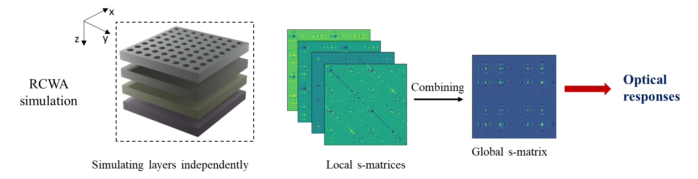
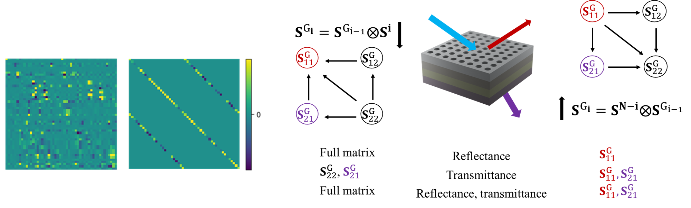
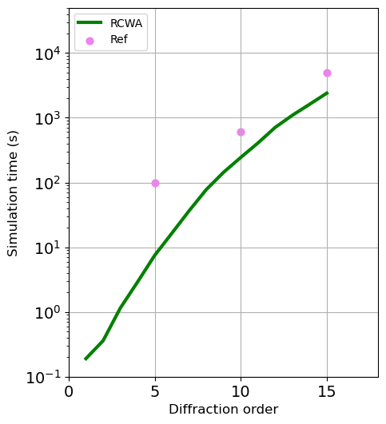
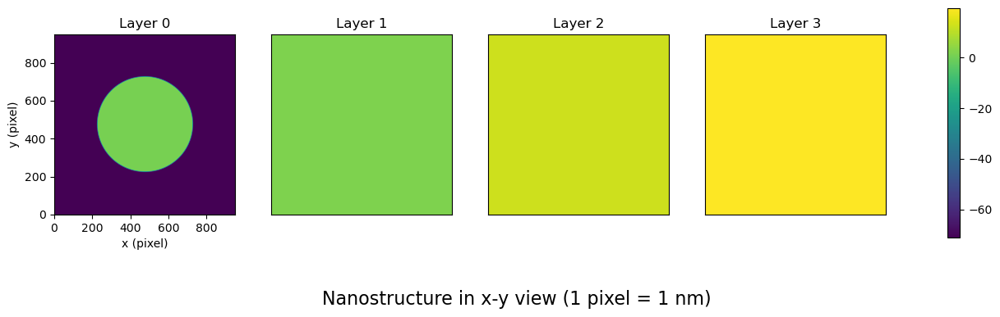
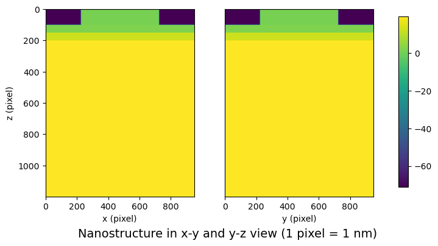

# RCWA in ScatteringM 

* Efficient for multilayers with bottom homogeneous layers
* Simple, easy to use: we need only 3 lines for the main part of the simulation

## Multilayers with bottom homogeneous layers

The RCWA method involves the semi-discretization of Maxwell ’s equations in Fourier space to compute scattering matrix (s-matrix) of layers and combine these multiple s-matrices into a global one to quantify the expected optical responses.



Although the computation of a homogeneous layer is simple, without solving the eigen decomposition, the handling stack of homogeneous layers could be a numerical issue in 3D structures as these layers involve expensive matrix algebra in order to connect to the grating layers

We introduce two techniques: vector-based computation and bottom-up construction [(Li.,JOSA,1996)](https://opg.optica.org/josaa/abstract.cfm?uri=josaa-13-5-1024). The vector-based computation compactly presents matrices involved in computing homogeneous layers by the vector of four diagonal elements

The bottom-up construction can reduce the elements of global S-matrix to quantify optical responses



The benchmark was implemented in plasmonic sensor.The jupyter notebooks are in [Example 2](1RCWA/Ex2_plasmonic_sensor_RT.ipynb) and [Example 3](1RCWA/Ex3_plasmonic_sensor_RT_advanced.ipynb). At the common diffraction order of  5 (or Fourier truncation=11), our RCWA was 10X faster. However, it must be noted that the comparison is relative. [Jon Schlipf and Inga A. Fischer, Opt.Express.2021](https://opg.optica.org/oe/fulltext.cfm?uri=oe-29-22-36201&id=461916) employed Julia in a node of a workstation cluster with 24 cores, while our work uses Python within a personal laptop equipped with Intel® core i7 CPU. 



## Simple, easy to use
#### Simulation
The main part of the simulation requires only  3 lines in a loop of wavelengths. Then, the optical responses are easily calculated from global S-matrix.   
```python
for wth in range(len(wavelength_range)): 
    #Update: Kx,Ky,kz_inc,Vg,Vzr,Vzt  
    Scattering.KxKy_Component(wavelength_range[wth],e_ref,e_trn[wth])      
    # S_layer       
    S_layer=[Scattering.S_Layer(Thickness_Sim[lth],ERC_CONV[lth][wth])  for lth in range(NL)] 
    # Combine for S_global
    S_global=Scattering.S_System(S_layer) 
```
The advanced use of vector-based computation and bottom-up construction to simulate the needed elements of global S-matrix is found in  [Example 3](1RCWA/Ex3_plasmonic_sensor_RT_advanced.ipynb)

### Geometry
```python
e_m=[e_Al,e_SiO2,e_Si,e_Ge] 
Geometry=[]
for lth in range(NL):
    layer_lth={}      
    if lth ==0: # first layer: grating
        layer_lth['Shape']=Geo.Circle
        layer_lth['e_base']=e_m[lth]
        layer_lth['e_grt']=1 # air
        layer_lth['Critical']=[Diameter]
        layer_lth['Center']=[Lx_cell/2,Ly_cell/2]
    else: # homogeneous
        layer_lth['Shape']='Homo'
        layer_lth['e_base']=e_m[lth]   
    Geometry.append(layer_lth)  
```

### Layer view 
```python
geo_e=np.array([Plot.Geo_viz(layer_lth) for layer_lth in Geometry])
Plot.Viz_xy(geo_e,pos_layer=[0,1,2,3])
Plot.Viz_z(geo_e,Thickness_Sim)
```




The nanostructure is presented in pixel and the real part of layer dielectric values.  


