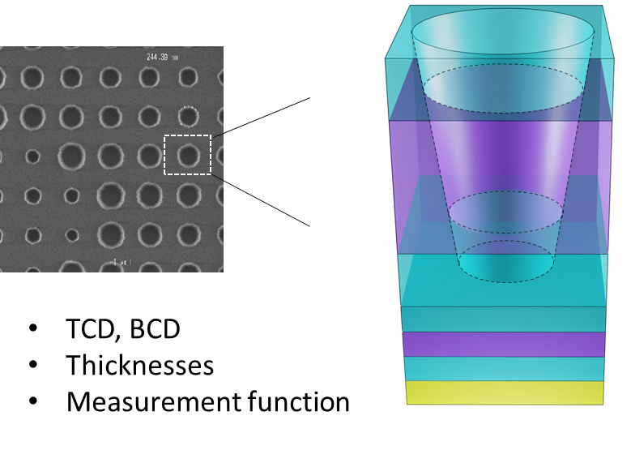
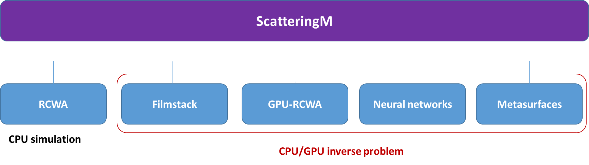
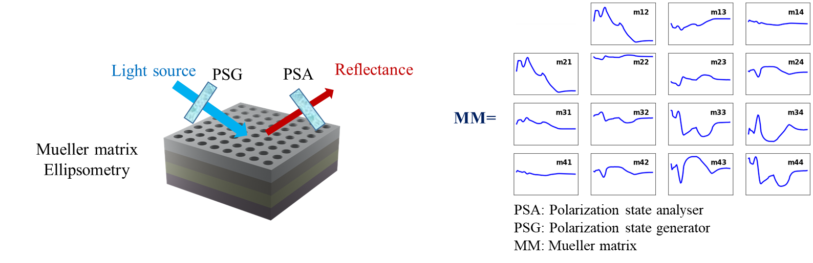
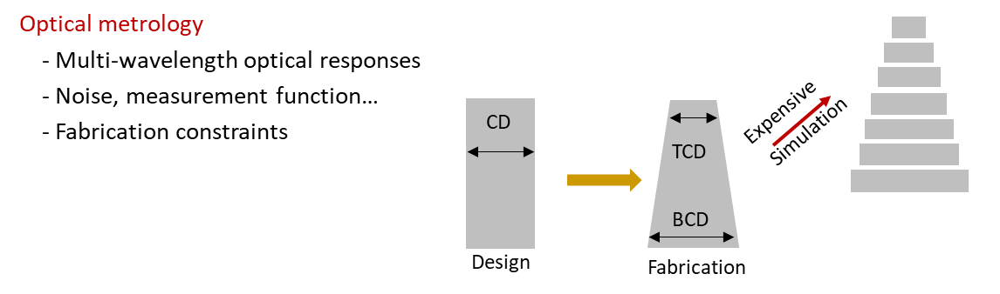
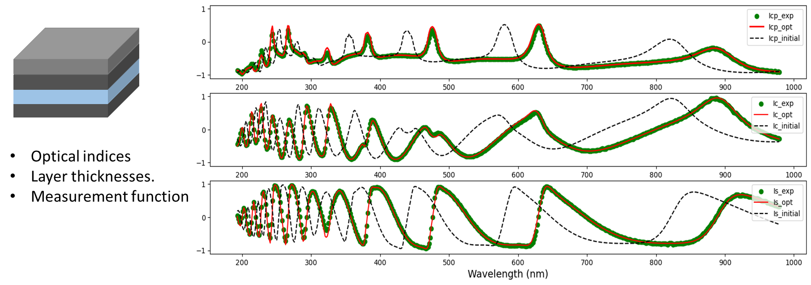
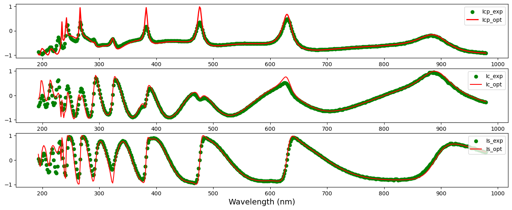
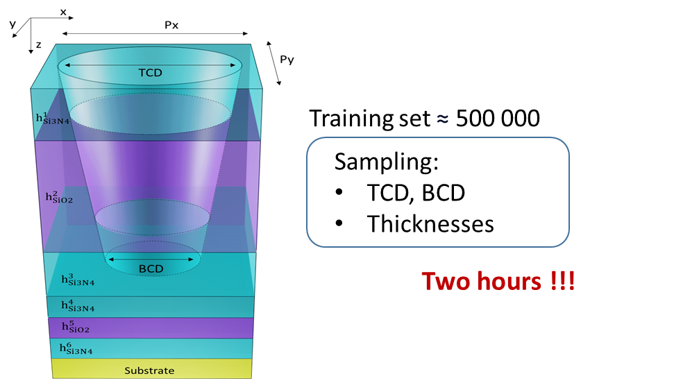
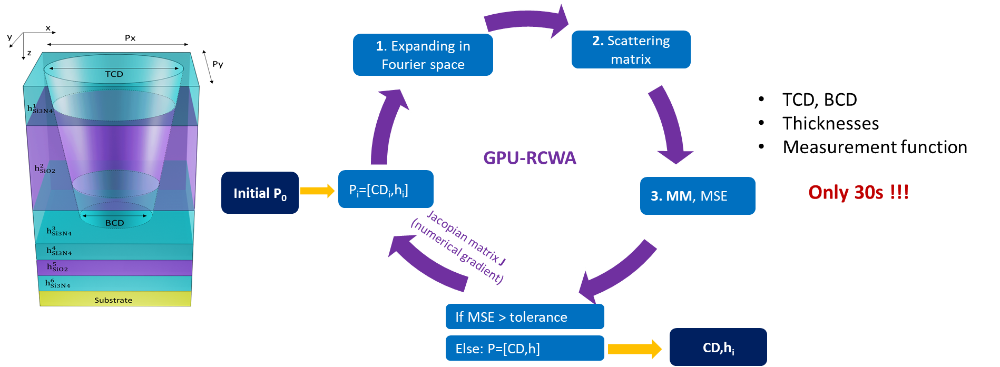
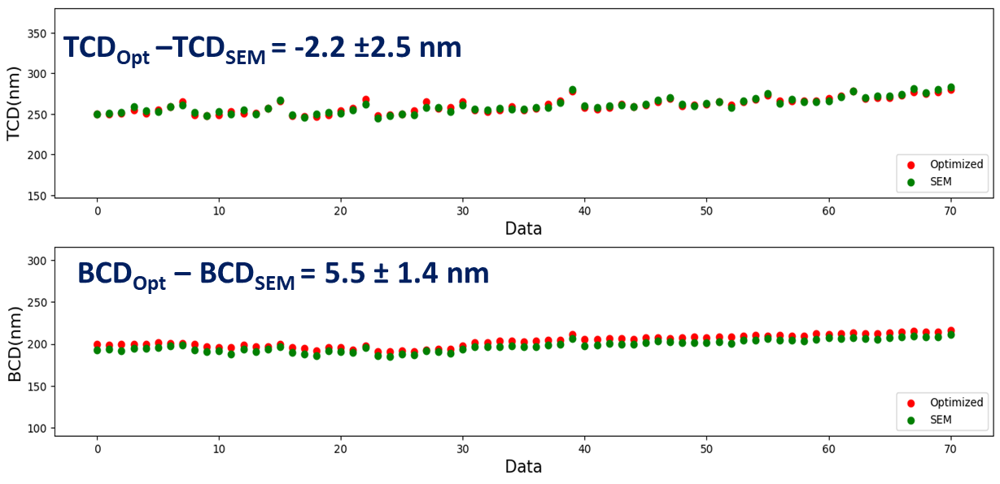

# ScatteringM

### ScatteringM
ScatteringM aims to provide efficient solutions for optical metrology, inverse design and full wave simulation of multilayers. The key factor of ScatteringM is ultrafast RCWA simulations for both subwavelength gratings and large areas. We have developed a new algorithm to successfully **run RCWA on GPUs**.

### History:
ScatteringM has been developing since 2020. At the beginning, the idea was to use neural networks (NN) for optical metrology. However, current NNs usually study simple 2D/3D structures with few paramters that are not applicable for our practical case: 3D multilayers with tens of parameters   

We must strive for a break-through approach to meet the demand of such practical metrology. Step by step, ScatteringM has evolved to fulfill metrology challenges and now, ScatteringM is expanding to metasurfaces. 

### Application:
In optical metrology, ScatteringM enables accurate and fast solution for inverse problems to characterize: optical indices, CD_SEM, thickness... of multilayers from Spectrocopic, Mueller Ellipsometry in both Deep learning and heuristic approach:
* We established an efficient algorithm to massively generate training data to empower neural networks. 
* The heuristic approach based on GPU-RCWA in ScatteringM for inverse problems of multilayers with tens of parameteers is implemented in **second scales**.

Although ScatteringM is developed for optical metrology, ScatteringM can be used for large areas. I am very interested in using ScatteringM for inverse design and full wave simulation of metasurfaces. 

### ScatteringM structure:
ScatteringM consists of modules: 
* RCWA 
* Filmstack
* Neural networks
* GPU_RCWA 
* Large areas 

### Note 
In each module, you can find algorithms, examples, benchmarks... However, only the first module: RCWA simulation is released in this moment. 

### Optical metrology
Before going further to the modules, this section is a short introduction of optical metrology.

Unlike image-based metrology, optical metrology is not constrained by the limit of image resolution. Moreover, optical metrology permits 3D measurements. In recent years, Mueller Ellipsometry has been widely used for academic and industrial applications because this technique is very sensitive to optical responses. By measuring all polarizing states of the sample, all the information (grating dimensions, layer thicknesses, optical indices..) is in Mueller matrix.

Mueller Ellipsometry is an indirect measurement that needs inverse problems to extract physical properties from Mueller matrix. It is noted that the inverse problem in metrology is very complicated (more than inverse design). We confront multi-wavelength optical responses, noise, measurement function, fabrication constraints... 

### 1. RCWA simulation

This is the basic module in ScatteringM used for forward simulations. The module is only run on CPU. However, with two main improvements:
bottom-up construction and vector-based computation, the module is very efficient for multilayers with bottom homogeneous layers that can be **10X faster** than conventional RCWA. More details are found in [RCWA module](1RCWA).

In the module, you can find examples of 2D and 3D nanostructures in a wide range applications: Mueller Matrix Ellipsometry [Example 1](1RCWA/Ex1_Si_binary_MM.ipynb), Spectrocopic Ellipsometry [Example 7](1RCWA/Ex7_resine_MM.ipynb), [Example 8](1RCWA/Ex8_barc_resine_MM.ipynb),  Optical responses: Reflectance, Transmittance and Absorpbance [Example 2](1RCWA/Ex2_plasmonic_sensor_RT.ipynb), advanced use cases [Example 3](1RCWA/Ex3_plasmonic_sensor_RT_advanced.ipynb),phase of meta atoms [Example 4](1RCWA/Ex4_Si_square_atom_Fig1.ipynb), [Example 5](1RCWA/Ex5_Si_square_atom_Fig2.ipynb), [Example 6](1RCWA/Ex6_SiN_circle_atom.ipynb), 

### 2. Filmstack

Simulating thin films is very simple. Analytical solution is also available for few layers. However, the inverse problem of filmstack with high parameter space is still a challenge. 

In ScatteringM:

* The module Filmstack successfully  fulfills the inverse problem of tens of parameters in fews second within a personal laptop.

* We also examines measurement functions in optical metrology. Without considering measurement functions, the inverse problem may never fit the measured data.

We can see 'the risk' if measurement function is not considered.

More details can be found in [Filmstack](2Filmstack)

### 3. Neural networks

Neural network approach has been recently applied for inverse problems. Since the performance of neural networks  highly depends on training data, the quality and quantity of traning dataset are very important. 

In ScatteringM:
* We develop an efficient algorithm of parallel computing to massively generate (synthetic) training data. 
* In the use case of industrial 3D multilayers, we generated ≈ 500000 training data less than 2 hours (conventional RCWA can take months or year)

More details can be found in [NeuralNetwork](3NeuralNetwork)

### 4. GPU-RCWA

Although NNs were successfully deployed, we simulated training data with the prior knowledge of the measurement function calibrated from heuristic approach. Measurement function can be sampled to generate training data but it will entail expensive computation.

It is also noted that the accuracy of NNs is less favorable than heuristic approaches if the same solver is used for electromagnetic computation. We have continued to strive for a more general and rigorous solution. Finally, we successfully develop a new algorith enabling to run RCWA on GPUs. 

ScatteringM took about 30s for inverse problem of 3D structures with tens of parameters (only within a 6Gb GPU). The results were very close to CD-SEM.

More details can be found in [GPU-RCWA](4GPU_RCWA)

### 5. Metasurfaces

Coming soon :)

### Contact

ScatteringM has been developing . So do expect some bugs. If you find any bugs, please feel free to contact me: phamhoanglam.fr@gmail.com

### Reference

This work is primarily based on the Computational Electromagnetics coures of [Professor Raymond Rumpf](https://empossible.net/academics/emp5337/)

